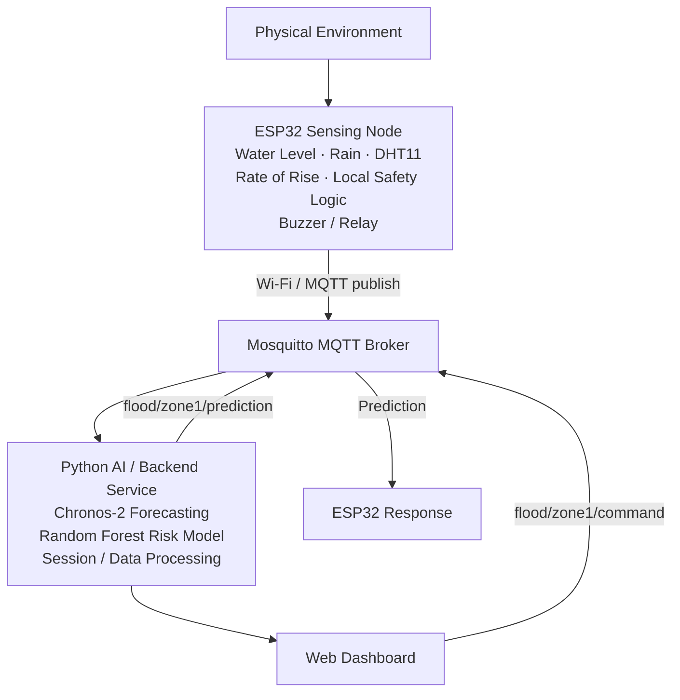
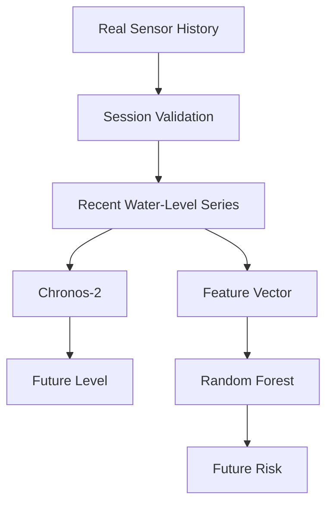
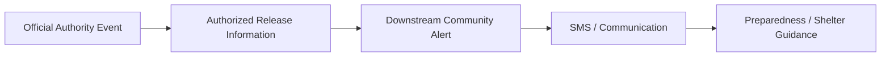
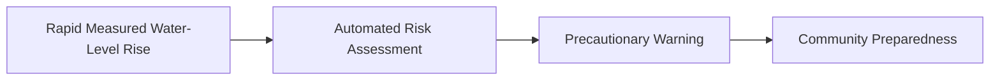

# IoT-Based Early Flood Detection and Avoidance System with Predictive AI


A laboratory-scale IoT and AI prototype that continuously monitors water level, estimates the rate of rise, publishes sensor observations over MQTT, forecasts short-term water-level behaviour, classifies future flood risk, and provides local warning and actuator control.

> **Scope notice:** This project is intended for laboratory demonstration and academic evaluation. It is **not** a field-certified flood-warning system.

---

## Table of Contents

1. [Overview](#1-overview)
2. [Project Objectives](#2-project-objectives)
3. [System Architecture](#3-system-architecture)
4. [Hardware](#4-hardware)
5. [Water-Level Calibration](#5-water-level-calibration)
6. [Signal Processing](#6-signal-processing)
7. [Rate-of-Rise Estimation](#7-rate-of-rise-estimation)
8. [Rain Sensor](#8-rain-sensor)
9. [AI and Prediction Pipeline](#9-ai-and-prediction-pipeline)
10. [Datasets](#10-datasets)
11. [Dashboard](#11-dashboard)
12. [Project Structure](#12-project-structure)
13. [Software Requirements](#13-software-requirements)
14. [Installation and Configuration](#14-installation-and-configuration)
15. [Running the System](#15-running-the-system)
16. [Collecting New Sensor Data](#16-collecting-new-sensor-data)
17. [Data Integrity Rules](#17-data-integrity-rules)
18. [Local Safety Behaviour](#18-local-safety-behaviour)
19. [Limitations](#19-limitations)
20. [Future Scope](#20-future-scope)
21. [Reproducibility](#21-reproducibility)
22. [Academic and Experimental Scope](#22-academic-and-experimental-scope)
23. [Safety Notice](#23-safety-notice)
24. [Authors](#24-authors)
25. [Project Status](#25-project-status)

---

## 1. Overview

The system combines an **ESP32-based sensing node**, environmental sensors, an **MQTT** communication layer, a **Python-based AI service**, and a **web dashboard**.

The implementation deliberately separates physical measurement from predictive intelligence. The ESP32 performs all measurement and retains deterministic local safety logic, while the AI service provides forecasting and risk classification as an additional layer.

## 2. Project Objectives

- Continuously measure water level using an ESP32.
- Estimate the rate of water-level rise from sequential measurements.
- Monitor rain/wetness conditions.
- Measure temperature and humidity.
- Transmit sensor observations using MQTT.
- Maintain a real sensor history without synthetic startup data.
- Forecast short-term water-level behaviour using Chronos-2.
- Classify future flood risk using a Random Forest model.
- Display live measurements and predictions through a web dashboard.
- Provide local buzzer and relay control.
- Maintain deterministic local safety behaviour even when the AI service is unavailable.
- Establish a foundation for future deployment at larger water bodies such as reservoirs and dams.

## 3. System Architecture



### 3.1 Layers

| Layer | Responsibilities |
|---|---|
| **Sensing** | Water-level ADC, rain-sensor ADC, temperature, humidity |
| **Embedded processing** | ADC acquisition, median filtering, empirical calibration, exponential smoothing, sensor-validity checks, rate-of-rise estimation, rain-state classification, local warning logic, relay control, MQTT communication |
| **Communication** | ESP32 → Wi-Fi → Mosquitto MQTT broker |
| **AI / backend** | Session validation, Chronos-2 forecasting, Random Forest risk classification, HTTP service for the dashboard |
| **Presentation** | Web dashboard served by the Python backend |

### 3.2 MQTT Topics

| Topic | Direction | Description |
|---|---|---|
| `flood/zone1/sensors` | ESP32 → Broker | Measurements generated by the ESP32 |
| `flood/zone1/prediction` | Backend → Broker | Forecast and risk results generated by the Python backend |
| `flood/zone1/command` | Dashboard → Broker | Dashboard actuator commands |

## 4. Hardware

### 4.1 Components

| Component | Purpose |
|---|---|
| ESP32 Dev Module | Main embedded controller |
| Resistive water-level probe | Water-level measurement |
| Rain sensor | Rain/wetness indication |
| DHT11 | Temperature and humidity |
| Buzzer | Local audible warning |
| 1-channel 5 V relay | Pump/control interface |
| External 5 V supply | External actuator power |

> The HC-SR04 ultrasonic sensor and indicator LEDs were removed from the final implementation.

### 4.2 Final Pin Configuration

| Component | ESP32 Pin |
|---|---|
| Water-level sensor AO | GPIO34 |
| Rain sensor AO | GPIO35 |
| DHT11 DATA | GPIO4 |
| Buzzer | GPIO25 |
| Relay IN | GPIO23 |

Sensor and actuator power arrangements must follow the wiring configuration documented for the final hardware build.

## 5. Water-Level Calibration

The water-level probe is used over a demonstration range of approximately **0–4 cm**. The implementation performs piecewise-linear interpolation between the following empirical calibration points:

| ADC | Level (cm) |
|---:|---:|
| 0 | 0.0 |
| 520 | 0.5 |
| 1050 | 1.0 |
| 1665 | 2.0 |
| 1755 | 2.5 |
| 1870 | 3.0 |
| 1960 | 3.5 |
| 2060 | 4.0 |

The sensor should be treated as a laboratory-scale demonstration sensor, not as a calibrated field flood-depth instrument.

## 6. Signal Processing

For each water-level observation the ESP32 applies the following chain:

1. ADC burst acquisition
2. Median filtering
3. Piecewise-linear calibration
4. Exponential smoothing
5. Sensor-validity checking
6. Rate-of-rise estimation

The smoothing equation is:

```text
S(t) = α·X(t) + (1 − α)·S(t − 1)
```

where `X(t)` is the current calibrated measurement, `S(t)` is the filtered measurement, and `α = 0.75` in the final implementation.

## 7. Rate-of-Rise Estimation

The rate of water-level change is computed using a **Theil–Sen estimator** over a short recent history:

```text
rate = median( (level[j] − level[i]) / (time[j] − time[i]) )   for all i < j
```

This approach was selected after testing showed that a longer ordinary least-squares window could leave a false rate tail after the physical water level had already stabilized.

## 8. Rain Sensor

The rain sensor is treated as a **qualitative** wetness/rain-state sensor.

| Condition | State |
|---|---|
| `ADC >= 3000` | Dry |
| `ADC < 1500` | Heavy |
| otherwise | Light |

These categories must not be interpreted as calibrated rainfall intensity in millimetres per hour.

## 9. AI and Prediction Pipeline

The AI service runs on the laptop.



### 9.1 Chronos-2 Forecasting

The project uses the pretrained `amazon/chronos-2` model for short-term water-level forecasting, rather than training a new forecasting model on the small local dataset.

| Parameter | Value |
|---|---|
| Sensor interval | ≈ 5 s |
| History window | up to ≈ 10 min |
| Forecast horizon | 5 min |
| Future steps | 60 |

The first forecast is generated only after sufficient fresh sensor history has been collected. **No synthetic sensor history is used as a fallback.**

### 9.2 Random Forest Risk Classification

A separate Random Forest model classifies future risk. The live feature vector is:

```text
level_cm, rate_cm_min, rain_adc, temp_c, hum
```

The future label is determined from the maximum observed water level during the following five-minute window.

| Future Level | Prototype Risk |
|---|---|
| < 2.0 cm | LOW |
| 2.0 – < 3.0 cm | MODERATE |
| 3.0 – < 3.5 cm | HIGH |
| 3.5 – 4.0 cm | CRITICAL |

These are project-specific experimental labels and are **not** official flood-risk standards.

## 10. Datasets

### 10.1 Real-Sensor Dataset

| Property | Value |
|---|---|
| Accepted sensor observations | 398 |
| Separated collection sessions | 3 |
| Missing values | 0 |
| Duplicate timestamps | 0 |
| Median sampling interval | ≈ 5.017 s |
| Water-level range | 0–4 cm |

Environmental measurements were collected together with water-level measurements. The rain-state distribution covers Dry, Light, and Heavy conditions. The dataset is intended for prototype evaluation and is not representative of natural flood events at reservoir, river, or urban scales.

### 10.2 Risk Dataset

Future-window processing produced **293** usable future-labelled samples:

| Class | Samples |
|---|---:|
| LOW | 0 |
| MODERATE | 5 |
| HIGH | 46 |
| CRITICAL | 242 |

The dataset is highly imbalanced. A held-out balanced accuracy of **0.917** was obtained for the available classification experiment; this result should be interpreted cautiously because the dataset does not contain all risk classes.

## 11. Dashboard

The dashboard communicates with the Python backend through a local HTTP service and displays:

- Current water level
- Rate of rise
- Rain state
- Predicted water level and forecast horizon
- Future-risk category
- Alert state
- Temperature and humidity
- Pump state
- Station status
- Recent trend

Typical address: `http://localhost:8000`

## 12. Project Structure

```text
IoT-Flood-Detection/
├── src/
│   └── main.cpp            # ESP32 firmware
├── include/
├── lib/
├── test/
├── platformio.ini
├── flood_ai.py             # AI / backend service
├── collect_real_data.py    # Real-sensor data collector
├── dashboard.html          # Web dashboard
├── flood_data.csv          # Curated real-sensor dataset
└── README.md
```

The exact contents may change during development.

## 13. Software Requirements

- PlatformIO and Visual Studio Code
- Arduino/ESP32 PlatformIO environment
- Mosquitto MQTT broker
- Python 3.x with a virtual environment
- Python packages: MQTT client (e.g. `paho-mqtt`), NumPy, pandas, scikit-learn, Chronos forecasting package, Joblib

## 14. Installation and Configuration

### 14.1 Python Environment

The AI and data-processing components were executed using a dedicated Python virtual environment. The environment contains the libraries required for MQTT communications, numerical processing, data handling, machine-learning classification, model persistence, and Chronos-2 forecating.

The principal packages used by the finalized software environment are:
paho-mqtt
numpy
pandas
scikit-learn
joblib
chronos-forecasting

```powershell
python -m venv .venv
.\.venv
pip install paho-mqtt numpy pandas scikit-learn joblib chronos-forecasting
```

Verify that all required packages are installed in this environment before running the AI service.

### 14.2 MQTT Broker

Mosquitto runs locally and listens on **TCP 1883**. The ESP32 must use the laptop's current LAN IP address as the broker address:

```cpp
const char* MQTT_HOST = "<LAPTOP_LAN_IP>";
const int   MQTT_PORT = 1883;
```

Do not permanently hard-code an old laptop IP into the firmware, as the address can change under DHCP.

For the laboratory prototype, anonymous MQTT access may be used. A production deployment requires authentication, authorization, encrypted transport, and appropriate network controls.

## 15. Running the System

1. **Connect hardware.** Wire the ESP32 and sensors according to [Section 4.2](#42-final-pin-configuration) and power the board.
2. **Upload firmware.** In PlatformIO, run *Build* then *Upload*. Open the serial monitor at `115200` baud and confirm that Wi-Fi and MQTT connect successfully.
3. **Start Mosquitto.** Ensure the broker is running and listening on port `1883`.
4. **Start the AI backend.**

   ```powershell
   cd "<path-to>/IoT-Flood-Detection"
   .\.venv\Scripts\python.exe flood_ai.py serve
   ```

5. **Open the dashboard** at `http://localhost:8000`.
6. **Allow sensor history to accumulate.** Chronos-2 does not produce a forecast immediately at startup. Allow the system to run for several minutes before evaluating the forecast and risk display.

## 16. Collecting New Sensor Data

```powershell
cd "<path-to>/IoT-Flood-Detection"
.\.venv\Scripts\python.exe collect_real_data.py
```

The collector subscribes to `flood/zone1/sensors` and records real observations with the following fields:

```text
ts, level_cm, rate_cm_min, rain_adc, rain_status,
temp_c, hum, water_adc, sensor_ok, uptime_s
```

> **Warning:** Back up the existing dataset before replacing it if the trained risk model is still required.

## 17. Data Integrity Rules

This project intentionally avoids synthetic sensor values.

**Do not** add `fakeSample()` or simulated water-level readings to the production demonstration path.

**Do not** substitute unavailable AI predictions with:

- straight-line forecasts;
- manually generated HIGH/CRITICAL labels;
- rule-based values presented as AI predictions;
- fabricated sensor readings.

When the AI service lacks sufficient history or is unavailable, the correct behaviour is to report prediction/risk as **unavailable or unknown**.

## 18. Local Safety Behaviour

The ESP32 retains local safety logic because the laptop AI service and network connection are not guaranteed to be available at every instant. The embedded system can:

- monitor measured water level;
- detect local warning/danger conditions;
- activate the buzzer;
- control the relay;
- report actuator state.

The AI layer provides predictive information but does not replace the basic local safety mechanism.

## 19. Limitations

| Area | Limitation |
|---|---|
| **Sensor scale** | The probe covers ≈ 0–4 cm; suitable for laboratory demonstration, not for reservoirs or rivers. |
| **Dataset size** | 398 accepted observations is small for broad flood-event modelling. |
| **Class imbalance** | CRITICAL samples greatly outnumber MODERATE samples, and no LOW samples exist. |
| **Forecast validation** | Chronos-2 integration is verified, but no statistically meaningful independent forecast-error evaluation has been established. |
| **Rain measurement** | The rain sensor provides qualitative states only, not calibrated rainfall intensity. |
| **Network security** | The laboratory MQTT configuration is unsuitable for Internet-facing deployment. |

## 20. Future Scope

A major future direction is scaling the system to dams, reservoirs, and other large water-storage locations, with two distinct warning paths.

**Path 1 — Official authority event**



When authorities formally declare a gate-opening or water-release event, the system could distribute warnings to registered downstream communities via SMS and other channels.

**Path 2 — Measured rapid rise**



This path operates when an official decision is delayed but the monitoring network detects a rapid and sustained rise. It should be treated as a **precautionary warning** unless the responsible authority has formally authorized it as an evacuation mechanism.

**Planned work**

- Field-grade water-level sensors and redundant sensing
- Longer data collection and multiple monitoring stations
- Improved rainfall measurement
- Independent forecast evaluation
- Secure MQTT and authenticated authority messages
- SMS delivery tracking and alert acknowledgement
- Location-specific safe-zone information
- Event logging and audit trails

## 21. Reproducibility

1. Use the documented hardware configuration.
2. Use the final ESP32 firmware.
3. Start Mosquitto before starting the AI service.
4. Confirm that the ESP32 is publishing real sensor messages.
5. Start the Python backend.
6. Allow fresh sensor history to accumulate.
7. Open the dashboard.
8. Record the experiment session and timestamps.
9. Preserve the original CSV data.
10. Record any firmware, calibration, or model changes.

For meaningful AI evaluation, use separate collection sessions or events for evaluation rather than randomly mixing overlapping time windows.

## 22. Academic and Experimental Scope

**The reported results demonstrate:**

- real sensor acquisition;
- empirical calibration;
- embedded filtering;
- robust rate estimation;
- MQTT telemetry;
- live dashboard integration;
- Chronos-2 loading and live integration;
- Random Forest future-risk classification;
- local actuator response.

**The results do not establish:**

- field-scale flood prediction accuracy;
- reservoir-scale water forecasting;
- certified evacuation capability;
- official emergency-warning authority;
- guaranteed SMS delivery;
- production-grade cybersecurity;
- universal flood-risk thresholds.

## 23. Safety Notice

> **This prototype must not be used as the sole basis for real-world evacuation decisions.**

A production deployment around dams, reservoirs, rivers, or populated downstream areas would require:

- validated field sensors;
- redundant communication;
- robust power systems;
- authenticated authority integration;
- independent emergency procedures;
- validated warning thresholds;
- extensive field testing;
- regulatory and institutional approval.

## 24. Authors

**Charan Tharak Varma** — Registration No.: RA2411047020014

## 25. Project Status

**Current status:** Laboratory-scale integrated prototype.

```text
ESP32 → Real Sensor Measurements → MQTT / Mosquitto → Python Backend
      → Chronos-2 Forecast + Random Forest Risk Classification
      → Dashboard + MQTT Prediction → ESP32 Local Response
```

The project is ready for continued experimentation, larger real-data collection, independent model evaluation, and future field-scale system design.
